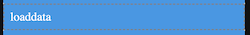
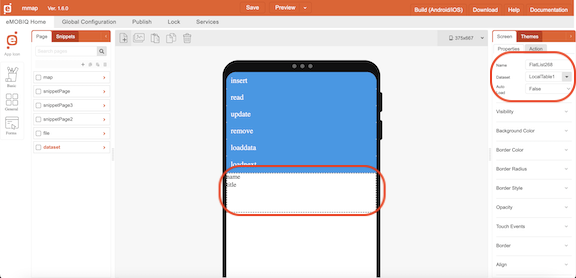
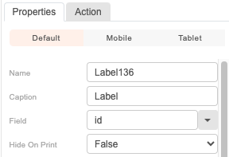
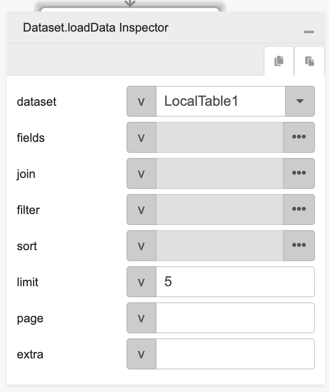

# loadData

## Description

Loads the data from a local table or connector.

## Input / Parameter

| Name | Description | Input Type | Default | Options | Required |
| ------ | ------ | ------ | ------ | ------ | ------ |
| dataset | Name of the dataset that is created in services. | Text | - | - | Yes |
| fields | Will contain a single object, or a list of one (1) or more objects which consist of: dataset, field, title. | Object | - | - | - |
| join | Join filters to be applied, which consist of: type, dataset, filter. | Object | - | - | - |
| filter | Filters to be applied, which consist of: dataset, field, operator, value, dataset1, field1, dataset2, field2. | Object | - | - | - |
| sort | Will contain a single object, or a list of one (1) or more objects which consist of: dataset, field, order. | Object | - | - | - |
| limit | Number of data that will be returned. | Number | - | - | - |
| page | Pagination number. | Number | - | - | - |
| extra | extra parameter to pass into callback. | Text | - | - | - |

## Output

Formatted Result

## Callback

### callback

The function to be executed when the loadData runs successfully.

### errorCallback

The function to be executed when the loadData runs unsuccessfully.

## Video

Coming Soon.

<!-- Format:  -->

## Example

The user wants to load the data from `Local Table` to be used in a flatlist component, (this example will only works after the user has created the data using `Dataset.insert` function).

<!-- Share a scenario, like a user requirements. -->

### Steps

| No. | Description |  |
| ------ | ------ | ------ |
| 1. |  | Make sure the `Local Table` component that's being used in `Dataset.insert` function example is exist and filled on the services panel in the service page. |
| 2. |  | Drag a button component to a page in the mobile designer. |
| 3. |  | Drag a flatlist component to a page in the mobile designer, and drag a label component into the newly created flatlist component. |
| 4. |  | Fill the flatlist component property in the page and fill the label component property in the flatlist component, make sure the label component field value match with the key of the data that being stored in the local storage. |
| 5. |  | Select the event `press` and drag the `Dataset.loadData` function to the event flow and fill in the parameter. |
| 6. |  | Open the preview and try to press the Button, the flatlist component should display the data from local storage. |

<!-- Show the steps and share some screenshots.

1. .....

Format:  -->

### Result

Should be able to load the data from local storage and display it on flalist component.

<!-- Explain the output.

Format:  -->

## Links
