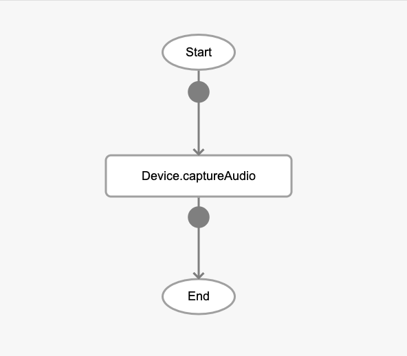
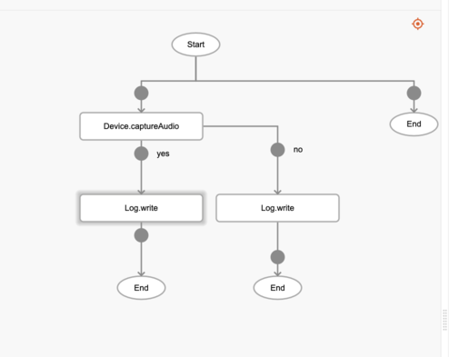
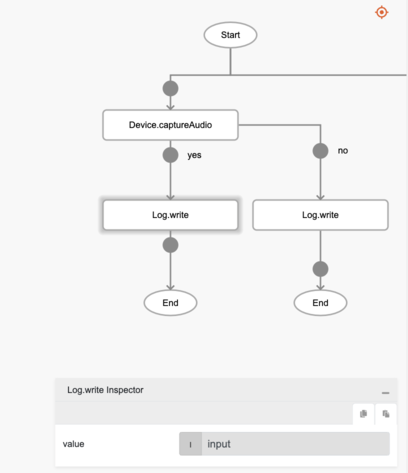

# Device.captureAudio

## Description

Activates the voice recording UI to capture audio.

## Input / Parameter

N/A

## Output

| Description | Output Type |
| ------ | ------ |
| Returns the formatted information. | Object |

### Object

| Key | Description | Output Type |
| ------ | ------ | ------ |
| success | Boolean value to denote whether the function was executed successfully. | Text |
| message | The message to print. | Text |
| data | Any additional message or data to print. | Text |

## Callback

### callback

The function to be executed when the voice recording is generated successfully.

### errorCallback

The function to be executed when the voice recording is not generated successfully.

<!-- Format:  -->

## Example

The user wants to create a voice recording using their mobile device.

<!-- Share a scenario, like a user requirements. -->

### Steps

| No. | Description |  |
| ------ | ------ | ------ |
| 1. |  | Drag a button component to a page in the mobile designer. Select the event `click` and drag the `Device.captureAudio` function to the event flow. |
| 2. |  | Drag the function to be executed if the audio recording is successful or failed to the node below the function. In this example, we are using the `Log.write` function. |
| 3. |  | Fill in the parameters of the function. |

<!-- Show the steps and share some screenshots.

1. .....

Format:  -->

### Result

The path of the audio file will be shown in the console.

<!-- Explain the output.

Format:  -->

## Links
