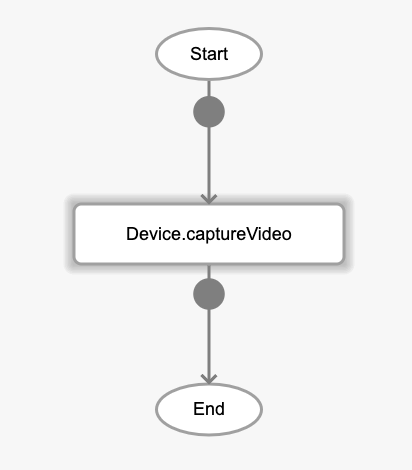

# captureVideo

## Description

Activates the video recording of the mobile device to capture video.

## Input / Parameter

N/A

## Output

Formatted Result

## Callback

### callback

The function to be executed when the video recording is generated successfully.

### errorCallback

The function to be executed when the video recording is not generated successfully.

## Video

Coming Soon.

<!-- Format:  -->

## Example

The user wants to create a video recording using their mobile device.

<!-- Share a scenario, like a user requirements. -->

### Steps

| No. | Description |  |
| ------ | ------ | ------ |
| 1. |  | Drag a button component to a page in the mobile designer. Select the event `click` and drag the function `Device.captureVideo` to the event flow. |
| 2. |  | Drag the function to be executed if the video recording is successfully generated to the node below the function. In this example, we are using the `Log.write` function. |
| 3. |  | Fill in the parameters of the function. |

<!-- Show the steps and share some screenshots.

1. .....

Format:  -->

### Result

The path of the video file will be shown in the console.

<!-- Explain the output.

Format:  -->

## Links
