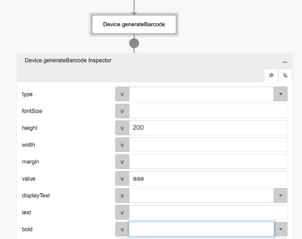
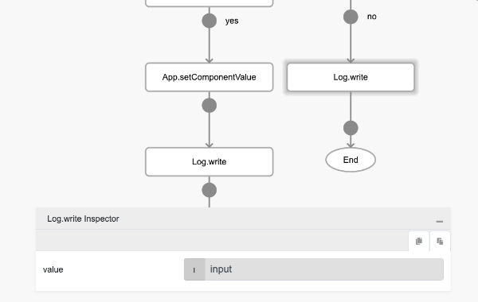
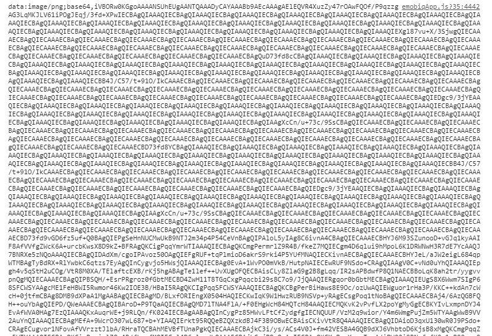
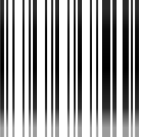

# Device.generateBarcode

## Description

Creates a machine-readable code in the form of numbers and a pattern of parallel lines of varying widths.

## Input / Parameter

| Name | Description | Input Type | Default | Options | Required |
| ------ | ------ | ------ | ------ | ------ | ------ |
| type | The type of barcode. | String/Text | CODE128 | - | No |
| fontSize | The font size of the barcode. | Number | 20 | - | No |
| height | The height of the barcode. | Number | 100 | - | No |
| width | The width of the barcode. | Number | 2 | - | No |
| margin | The margin of the barcode. | Number | 10 | - | No |
| value | The value of the barcode. | String/Text | - | - | Yes |
| displayText | To display text or not. | Boolean | true | - | No |
| text | The text to display. | String/Text | - | - | No |
| bold | Bolds the text. | String/Text | - | - | No |
| italic | Italicizes the text. | String/Text | - | - | No |
| textAlign | To align text or not. | String/Text | center | - | No |
| extra | Additional data to be used in the callbacks. | Any | - | - | No | 

## Output

| Description | Output Type |
| ------ | ------ |
| Returns the base64 barcode image pattern. | String/Text |

## Callback

N/A

## Video

Coming Soon.

<!-- Format:  -->

## Example

The user wants to generate a barcode.

### Step

1. Call the function "Device.generateBarcode" and set the value for barcode.
    
   height : 200  
   value : aaa
   
   

2. Drag in an Image Component to the Editor to display to generated Barcode.
  
    

2. Call the function "App.setComponentValue" if the generateBarcode is successful and set the value for Image component.
    
   component: imgQR 
  
    

   
3. Add a Log.write for display the response from     console.
   
   
 
### Result

   
   
   

## Links