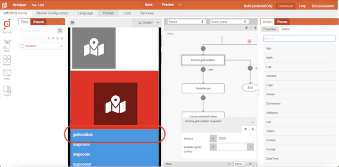
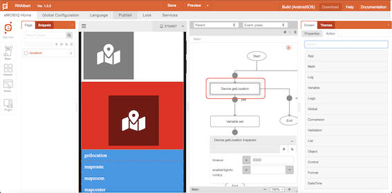
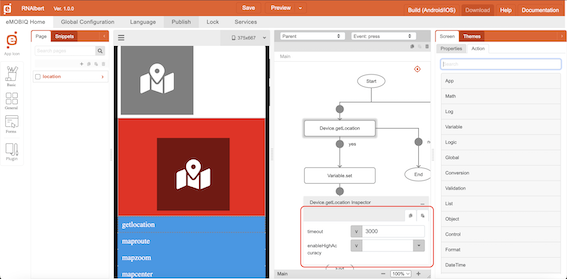
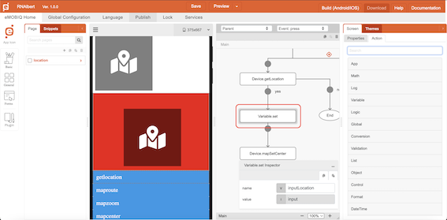
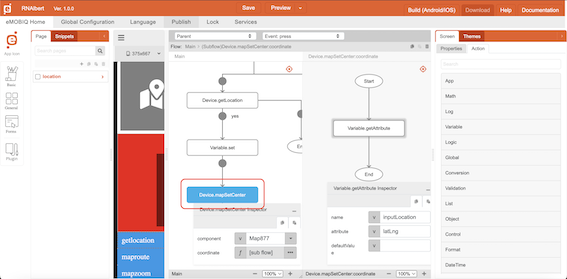

# getLocation

## Description

Get the current location details (GPS coordinate) of the device.

## Input / Parameter

| Name | Description | Input Type | Default | Options | Required |
| ------ | ------ | ------ | ------ | ------ | ------ |
| timeout | Connection time out period, in millisecond. | Number | - | - | - |
| enableHighAccuracy | To enable or disable high accuracy of GPS coordinates. | Boolean | False | - | - |

## Output

Formatted Result

## Callback

### callback

The function to be executed when location is obtained successfully.

### errorCallback

The function to be executed when location is not obtained successfully.

## Example

The user wants to get their locations data and use it as the coordinate value of setMapCenter function

<!-- Share a scenario, like a user requirements. -->

### Steps

| No. | Description |  |
| ------ | ------ | ------ |
| 1. |  | Make sure Map component is exist on the page and add a button component on that page |
| 2. |  | Select the event `press` for the button and drag the function `Device.getLocation` to the event flow. |
| 3. |  | Fill in the parameters of the function. |
| 4. |  | Drag the the function to be executed if the location data successfully received to the node below the function. In this example, we are using the `Variable.set` to save the location data into a variable. |
| 5. |  | Drag the the function `Device.setMapCenter` and Fill in the parameters of the function, use the location data from `Device.getLocation` by adding `Variable.getAttribute` on the `coordinate` field |

### Result

The location data will be received and it's `latLng` or latitude longitude value will be used as the center of the Map component 

<!-- Explain the output.

Format:  -->

## Links