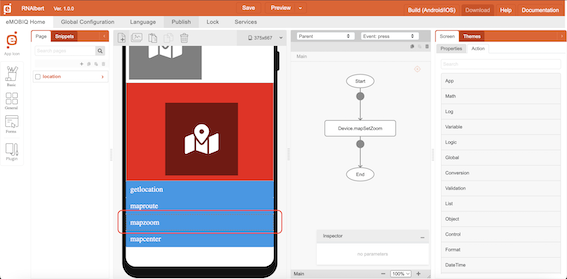
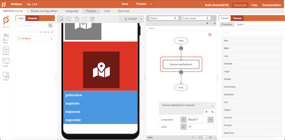
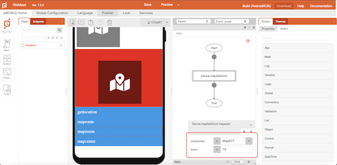

# mapSetZoom

## Description

Zoom in or out of the map component.

## Input / Parameter

| Name | Description | Input Type | Default | Options | Required |
| ------ | ------ | ------ | ------ | ------ | ------ |
| component | The name of the map component. | Text | - | - | Yes |
| zoom | The value to zoom by. | Number | - | - | - |

## Output

N/A

## Example

The user wants to set their Map component zoom value by using mapSetZoom function

<!-- Share a scenario, like a user requirements. -->

### Steps

| No. | Description |  |
| ------ | ------ | ------ |
| 1. |  | Make sure Map component is exist on the page and add a button component on that page |
| 2. |  | Select the event `press` for the button and drag the function `Device.mapSetZoom` to the event flow. |
| 3. |  | Fill in the parameters of the function. |

### Result

The zoom value of the Map component will follow the zoom value from `Device.mapSetZoom` function

<!-- Explain the output.

Format:  -->

## Links