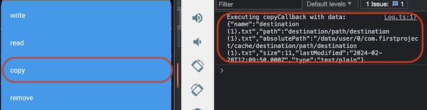

# copy

## Description

Copy a file.

## Note

This function cannot be tested on preview.

## Input / Parameter

| Name | Description | Input Type | Default | Options | Required |
| ------ | ------ | ------ | ------ | ------ | ------ |
| sourceFileName | name of the source file. | Text | - | - | Yes |
| sourceFolder | folder path to the source file. | Text | - | - | - |
| destinationFileName | name of the destination file. | Text | - | - | Yes |
| destinationFolder | folder path to the destination file. | Text | - | - | - |
| extra | extra parameter to pass into callback. | Text | - | - | - |

## Output

Formatted Result

## Callback

### callback

The function to be executed when the file copy is successfully executed.

### errorCallback

The function to be executed when the file copy is unsuccessfully executed.

## Video

Coming Soon.

<!-- Format:  -->

## Example

The user wants to copy a file (this example will only works after the user has created a file using `File.write` function).

<!-- Share a scenario, like a user requirements. -->

### Steps

| No. | Description |  |
| ------ | ------ | ------ |
| 1. |  | Drag a button component to a page in the mobile designer. |
| 2. |  | Select the event `press` and drag the `File.copy` function to the event flow and fill in the parameter. |
| 3. |  | Open the installed app on a device with a debugger on and try to press the Button, if the copied file exist user should be able to see the content on the console. |

<!-- Show the steps and share some screenshots.

1. .....

Format:  -->

### Result

Should be able to see the content of the newly copied file from user device.

<!-- Explain the output.

Format:  -->

## Links
