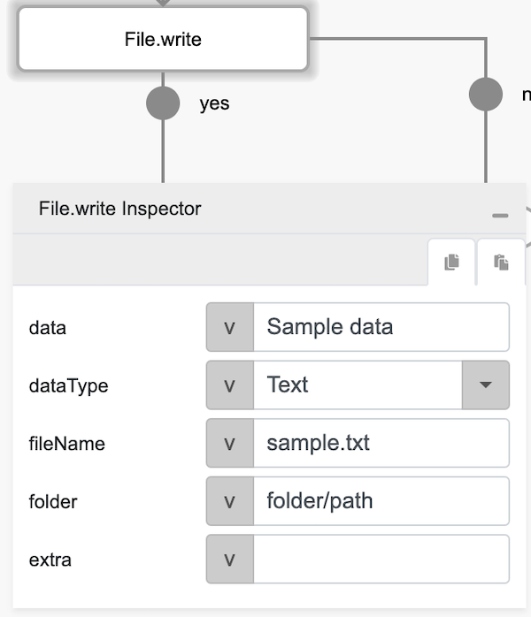

# write

## Description

Write data into a new file or rewrite existing file.

## Note

This function cannot be tested on preview.

## Input / Parameter

| Name | Description | Input Type | Default | Options | Required |
| ------ | ------ | ------ | ------ | ------ | ------ |
| data | content or data to write (in the form of base64, text, blob). | Text | - | - | Yes |
| dataType | content or data to write (in the form of base64, text, blob). | Text | - | Base64, Text, Byte_Array | Yes |
| fileName | name of the file. | Text | - | - | Yes |
| folder | folder path to the selected file. | Text | - | - | - |
| extra | extra parameter to pass into callback. | Text | - | - | - |

## Output

Formatted Result

## Callback

### callback

The function to be executed when the file is generated successfully.

### errorCallback

The function to be executed when the file is not generated successfully.

## Video

Coming Soon.

<!-- Format:  -->

## Example

The user wants to create a file with text value inside it.

<!-- Share a scenario, like a user requirements. -->

### Steps

| No. | Description |  |
| ------ | ------ | ------ |
| 1. |  | Drag a button component to a page in the mobile designer. |
| 2. |  | Select the event `press` and drag the `File.write` function to the event flow and fill in the parameter. |
| 3. |  | Open the installed app on a device and try to press the Button, the file will be created and ready to use. |

<!-- Show the steps and share some screenshots.

1. .....

Format:  -->

### Result

The file will be created in user device.

<!-- Explain the output.

Format:  -->

## Links
