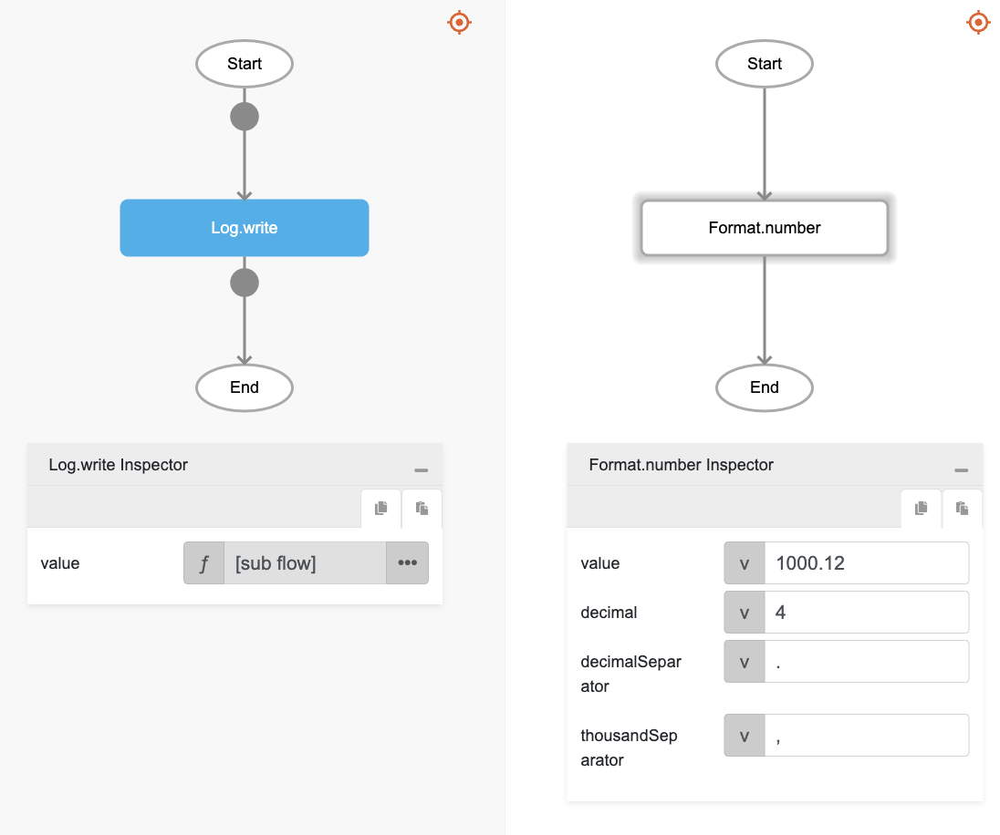

# Format.number

## Description

Formats a number using certain separators to be read better.

## Input / Parameter

| Name | Description | Input Type | Default | Options | Required |
| ------ | ------ | ------ | ------ | ------ | ------ |
| value | The value to be formatted. | Number | - | - | Yes |
| decimal | The number of decimal places that should be seen. Example: If the input is 5, the value will have 5 decimal place such as, 123.00000. | Number | - | - | No |
| decimalSeparator | The separator for decimals, such as a decimal point. | Text | - | - | No |
| thousandSeparator | The separator for millons and thousands place in values. Example: If the input is ' ', 1000000 will be returned as 1 000 000. | Text | - | - | No |

## Output

| Description | Output Type |
| ------ | ------ |
| Returns the formatted number with decimal point and separators where needed. | Text |

## Callback

N/A

## Video

Coming Soon.

## Example

The user wants to adjust a number's thousand and decimal separator.

### Step

1. Call the function `Format.number` inside the `Log.write` function.
Sample parameters are shown in the picture below.
     

    

### Result

The console will print `1,000.1200`.

## Related Information