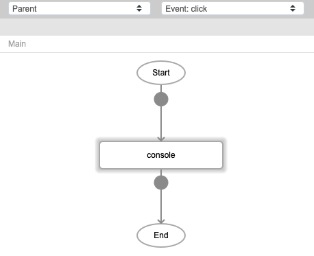
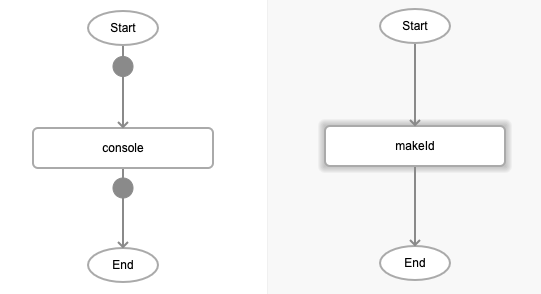

# makeId

## Description

Generates a unique ID or number.

## Input / Parameter

N/A

## Output

| Description | Output Type |
| ------ | ------ |
| Returns the unique ID, which is a series of numbers. | Number |

## Callback

N/A

## Video

Coming Soon.

<!-- Format:  -->

## Example

| No. | Description |  |
| ------ | ------ | ------ |
| 1. |  | Drag a button to a page in the mobile designer. Select the event `click` for the button and drag the `console` function to the event flow. |
| 2. |  | Select the `function` parameter input type for the value parameter. |
| 3. |  |Drag the `makeId` function to the node in the subflow. |

### Result

When the button is pressed, the console will show the unique id generated. A new unique id is returned everytime the button is pressed.

## Links