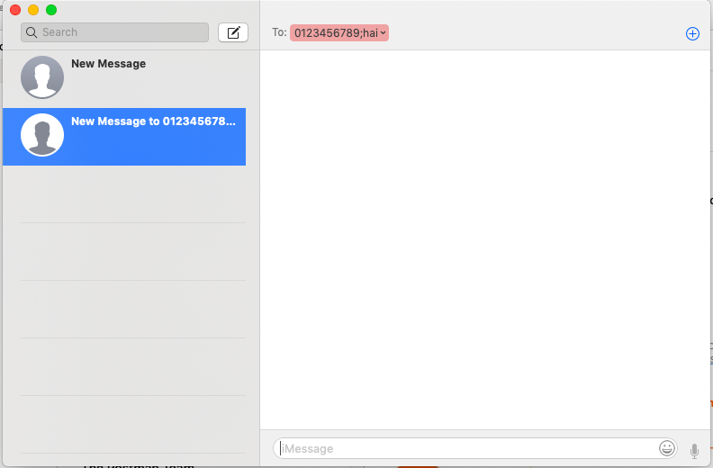

# intentSMS

## Description

This function will start a text message on the user's device's default messing application. 

## Input / Parameter

| Name | Description | Input Type | Default | Options | Required |
| ------ | ------ | ------ | ------ | ------ | ------ |
| phone | Recipient's phone number | String(?) | - | - | Yes | 
| message | Text message body | String | - | - | Yes | 

## Output

Opens the default text messaging application on user's device with the fields populated by input.

## Callback

N/A

## Video 

Coming Soon.

## Example

The user wants to start an email
 

### Steps

Using `intentSendSMS` with the parameters

|  | value |
| ---- | ---- | 
| phone | 0123456789 |
| message | hai | 

    
### Result

## Links

Coming Soon.