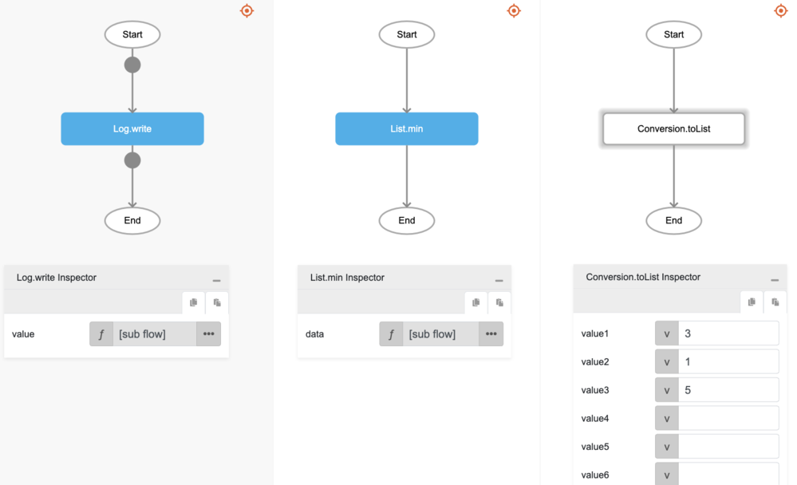

# min

## Description

Returns the smallest value of the numbers in the passed array.

## Input / Parameter

| Name | Description | Input Type | Default | Options | Required |
| ------ | ------ | ------ | ------ | ------ | ------ |
| value | The array of values to return the smallest value from. | Array/List | - | - | Yes |

## Output

| Description | Output Type |
| ------ | ------ |
| Returns the smallest value in the array. | Number |

## Callback

N/A

## Video

Coming Soon.

<!-- Format:  -->

## Example

The user wants to get the smallest of the numbers in a list and print the result in the console.
 

### Step

1. Call the function `List.min` inside the `Log.write` function, and then Call the function `Conversion.toList` inside the `List.min`.
     

    

### Result

The console will print `1`.

## Related Information