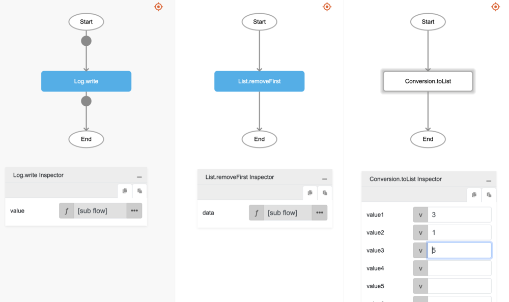

# List.removeFirst

## Description

Removes the first element in a list.

## Input / Parameter

| Name | Description | Input Type | Default | Options | Required |
| ------ | ------ | ------ | ------ | ------ | ------ |
| data | The list to be updated. | List | - | - | Yes |

## Output

| Description | Output Type |
| ------ | ------ |
| Returns the updated list. | List |

## Callback

N/A

## Video

Coming Soon.

## Example

The user wants to remove the first element in a list and print the updated list in the console.
 

### Step

1. Call the function `List.removeFirst` inside the `Log.write` function, and then Call the function `Conversion.toList` inside the `List.removeFirst`.
     

    

### Result

The console will print `[1, 5]`.

## Related Information