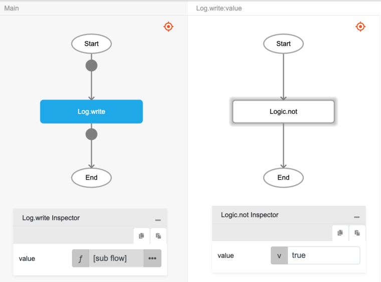

# Logic.not

## Description

'not' operator is a Boolean operator that returns true when the operand is false, and returns false when the operand is true. Essentially, the operator reverses the logical value associated with the expression on which it operates.

## Input / Parameter

| Name | Description | Input Type | Default | Options | Required |
| ------ | ------ | ------ | ------ | ------ | ------ |
| value | The input to be checked against. | Boolean | - | - | Yes |

## Output

| Description | Output Type |
| ------ | ------ |
| Returns true if operator is false, returns false otherwise. | Boolean |

## Callback

N/A

## Video

Coming Soon.

<!-- Format:  -->

## Example

The user wants to check if either of the values is true and print the result in the console.
 

### Step

1. Call the function `Logic.not` inside the `Log.write` function.
     
    value : true

    

### Result

The console will print 'false' since `value` is 'true'.

## Related Information