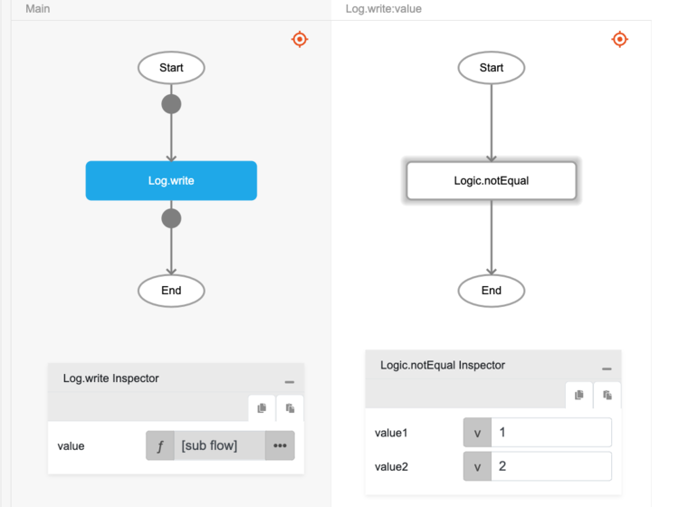

# notEqual

## Description

The not equal to comparison operator. It checks that two values are not equal. The result will return boolean values, true or false.

## Input / Parameter

| Name | Description | Input Type | Default | Options | Required |
| ------ | ------ | ------ | ------ | ------ | ------ |
| value1 | The first value to check. | Any | - | - | Yes |
| value2 | The second value to check. | Any | - | - | Yes |

## Output

| Description | Output Type |
| ------ | ------ |
| Returns true if the two values are not equal, returns false otherwise. | Boolean |

## Callback

N/A

## Video

Coming Soon.

<!-- Format:  -->

## Example

The user wants to check if value 1 is not equal to value 2.

### Step

1. Call the function `Logic.notEqual` inside the `Log.write` function.
     
    value1 : 1 
    value2 : 2 

    
     
### Result

true

## Links