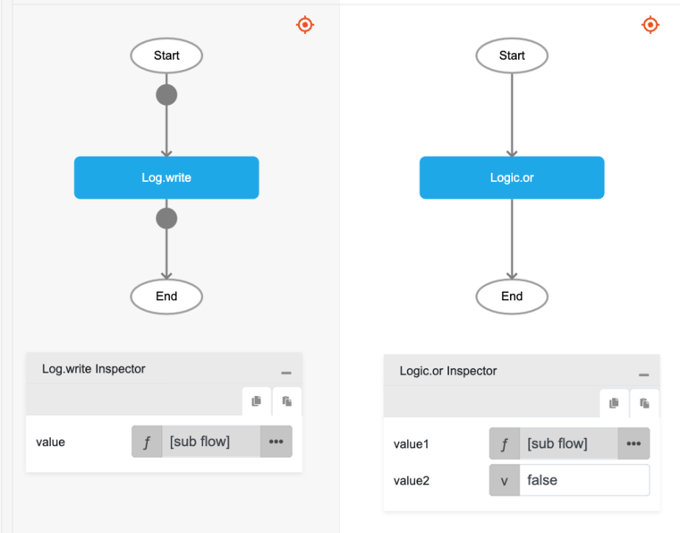

# Logic.or

## Description

'or' operator is a boolean operator that returns true if either operand is true and returns false otherwise. 

## Input / Parameter

| Name | Description | Input Type | Default | Options | Required |
| ------ | ------ | ------ | ------ | ------ | ------ |
| value1 | The first boolean value to check. | Boolean | - | - | Yes |
| value2 | The second boolean value to check. | Boolean | - | - | Yes |

## Output

| Description | Output Type |
| ------ | ------ |
| Returns true if either operator is true, returns false otherwise. | Boolean |

## Callback

N/A

## Video

Coming Soon.

<!-- Format:  -->

## Example

The user wants to check if either of the values is true and print the result in the console.
 

### Step

1. Call the function `Logic.or` inside the `Log.write` function.
     
    value1 : greater (value1:  3000 and value2:  1100) 
    value2 : false 

2. Call the function `Logic.greaterThan` inside the parameter `value1`.
     
    value1 : 3000 
    value2 : 1100 

    
    

### Result

The console will print 'true' since `value1` will return 'true' (3000 is greater than 1100) although `value2` returns false.

## Links