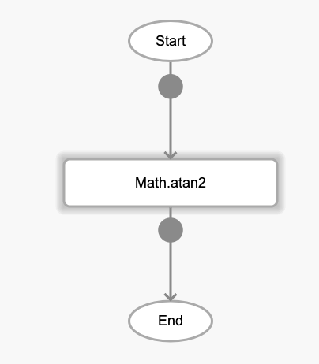
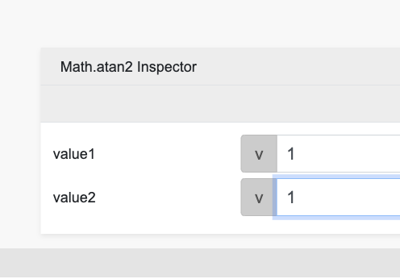

# Math.atan2

## Description

atan2 measures the counterclockwise angle θ, in radians, between the positive x-axis and the point (x, y). 

## Input / Parameter

| Name | Description | Input Type | Default | Options | Required |
| ------ | ------ | ------ | ------ | ------ | ------ |
| x | The x-axis value of the point (x, y). | Number | - | - | Yes |
| y | The y-axis value of the point (x, y). | Number | - | - | Yes |

## Output

| Description | Output Type |
| ------ | ------ |
| Returns the angle in radians. | Number |

## Callback

N/A

## Video

Coming Soon.

<!-- Format:  -->

## Example

1. Drag the `Math.atan2` function into the event flow.

    

2. Enter the value to be processed. For this example we use 1, 1.

    

### Result

0.7853981633974483

## Links