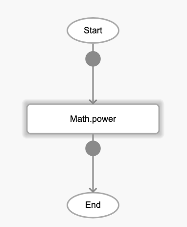
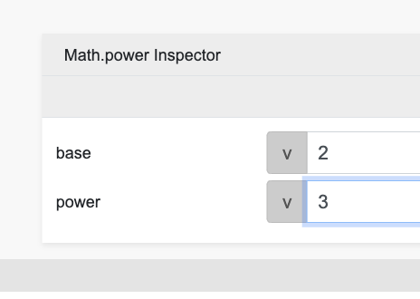

# Math.power

## Description

Exponentiation of two numbers. The output will return the base number raised to the power (or exponent) passed.

## Input / Parameter

| Name | Description | Input Type | Default | Options | Required |
| ------ | ------ | ------ | ------ | ------ | ------ |
| base | The base number to be raised. | Number | - | - | Yes |
| exponent | The number of powers to raise the base number to. | Number | - | - | Yes |

## Output

| Description | Output Type |
| ------ | ------ |
| Returns the base number raised to the power specified. | Number |

## Callback

N/A

## Video

Coming Soon.

<!-- Format:  -->

## Example

1. Drag the `Math.power` function into the event flow.

    

2. Enter the 2 values to be processed. For this example they are `2` and `3`.

    

### Result

8

## Links