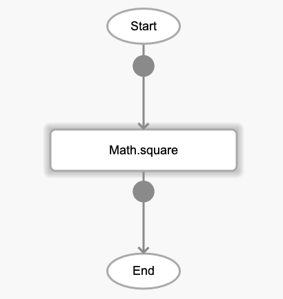
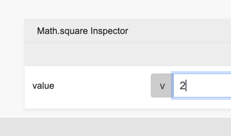

# Math.square

## Description

A squared number is the result of a number raised to the power of 2, or a number multiplied by itself.

## Input / Parameter

| Name | Description | Input Type | Default | Options | Required |
| ------ | ------ | ------ | ------ | ------ | ------ |
| value | The number to return the square of. | Number | - | - | Yes |

## Output

| Description | Output Type |
| ------ | ------ |
| Returns the squared value. | Number |

## Callback

N/A

## Video

Coming Soon.

<!-- Format:  -->

## Example

1. Drag the `Math.square` function into the event flow.

    

2. Enter the value to be squared. For this example we use 2.

    

### Result

4

## Links