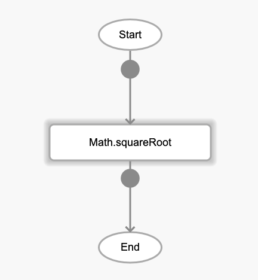
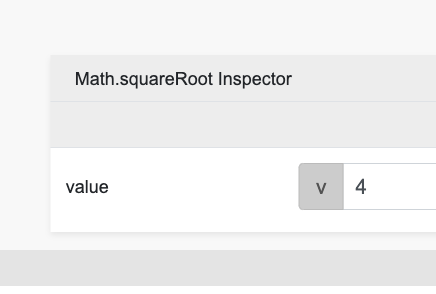

# Math.squareRoot

## Description

Get the square root of a number.

## Input / Parameter

| Name | Description | Input Type | Default | Options | Required |
| ------ | ------ | ------ | ------ | ------ | ------ |
| value | The number to return the square root of. | Number | - | - | Yes |

## Output

| Description | Output Type |
| ------ | ------ |
| Returns the square root value. | Number |

## Callback

N/A

## Video

Coming Soon.

<!-- Format:  -->

## Example

1. Drag the `Math.squareRoot` function into the event flow.

    

2. Enter the value to be processed. For this example we use 4.

    

### Result

2

## Links