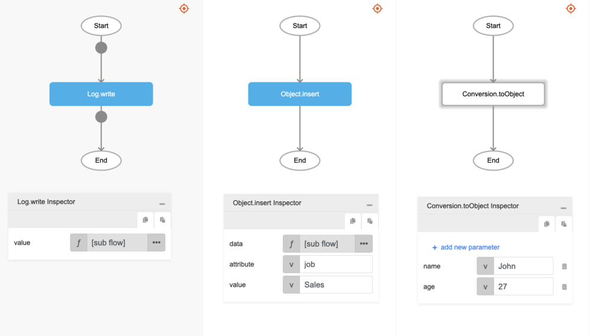

# Object.insert

## Description

Adds a key and a value to an object.

## Input / Parameter

| Name | Description | Input Type | Default | Options | Required |
| ------ | ------ | ------ | ------ | ------ | ------ |
| data | The reference object to be updated. | Object | - | - | Yes |
| attribute | The key to be added to the object. | Text | - | - | Yes |
| value | The value of the key. It can be null. | Any | - | - | No |

## Output

| Description | Output Type |
| ------ | ------ |
| Returns the updated object. | Object |

## Callback

N/A

## Video

Coming Soon.

## Example

The user wants to insert a new key and value to an object and print the updated object in the console.
 

### Step

1. Call the function `Object.insert` inside the `Log.write` function, and then Call the function `Conversion.toObject` inside the `Object.insert`.
Sample parameters are shown in the picture below.
     

    

### Result

The console will print `{age: '27', name: 'John', job: 'Sales'}`.

## Related Information