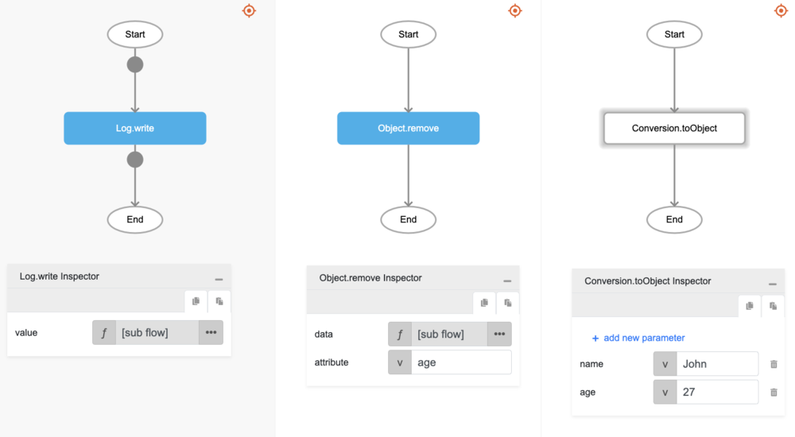

# Object.remove

## Description

Removes a value from an object using a key.

## Input / Parameter

| Name | Description | Input Type | Default | Options | Required |
| ------ | ------ | ------ | ------ | ------ | ------ |
| data | The reference object to be updated. | Object | - | - | Yes |
| attribute | The key of the value to be removed from the object. | Text | - | - | Yes |

## Output

| Description | Output Type |
| ------ | ------ |
| Returns the updated object. | Object |

## Callback

N/A

## Video

Coming Soon.

## Example

The user wants to remove a key from an object and print the updated object in the console.
 

### Step

1. Call the function `Object.remove` inside the `Log.write` function, and then Call the function `Conversion.toObject` inside the `Object.remove`.
Sample parameters are shown in the picture below.
     

    

### Result

The console will print `{name: 'John'}`.

## Related Information