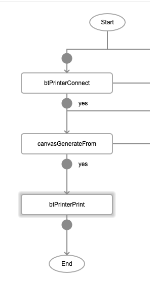
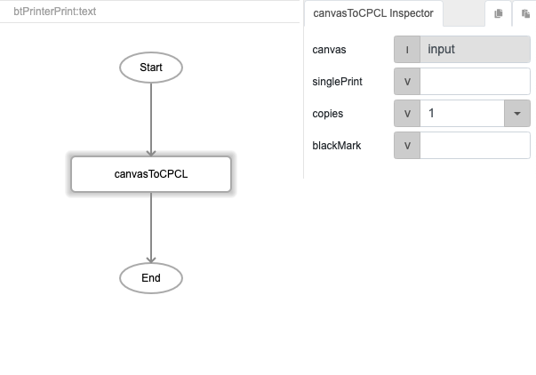
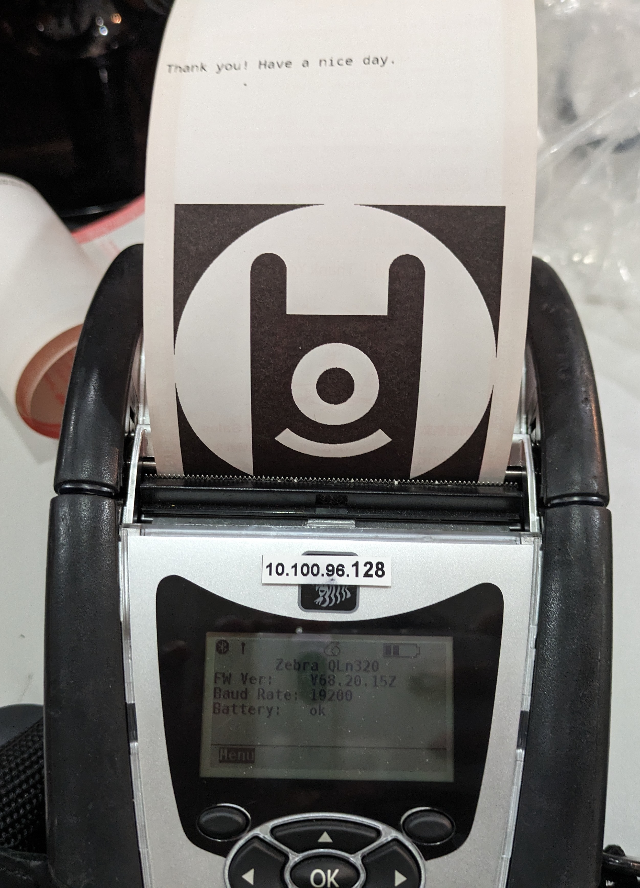

# canvasToCPCL

## Description

Converts a canvas to CPCL (Comtec Printer Control Language), a programming language used by printers.

## Input / Parameter

| Name | Description | Input Type | Default | Options | Required |
| ------ | ------ | ------ | ------ | ------ | ------ |
| canvas | The name of the canvas to convert. | String/Text | - | - | Yes |
| singlePrint | To print single-sided or not. | Boolean | true | true, false | No |
| copies | The number of copies to print. | Number | 1 | - | No |
| blackMark | To show black mark or not. | Boolean | false? | true, false | No |

## Output

N/A

## Callback

N/A

## Video

Coming Soon.

<!-- Format:  -->

## Example

### Steps

1. In this example, we will connect to a bluetooth printer, use `canvasToCPCL` to convert a canvas to CPCL which will be sent to the printer for printing.

    

2. For `btPrinterConnect`, enter the `printerId` of the bluetooth printer.

3. For `canvasGenerateFrom`, enter the details of the image or PDF to be converted to canvas. In this example we are using a base64 string of an image. 

    | Field | Value | 
    | ---- | ---- | 
    | type | base64 |
    | value | *(base64-encoded string of your image)* |
    | fileType | image | 

    

4. For `btPrinterPrint`, under the "text" field, add a function `canvasToCPCL` to convert the canvas format into CPCL (a language used by thermal printers).

    

### Result

Image will be printed by the connected bluetooth printer. 

## Links