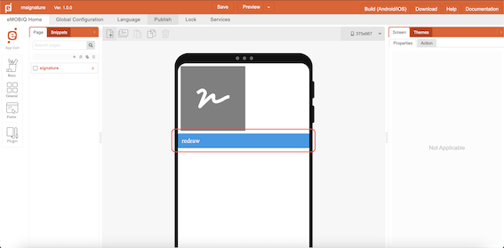
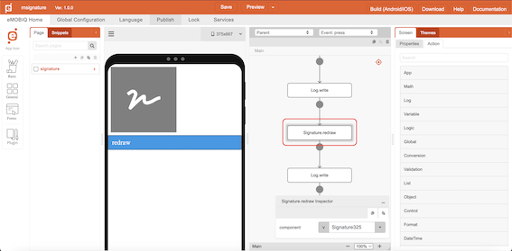
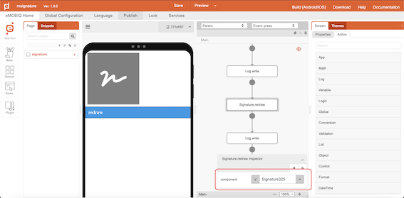

# Signature.redraw

## Description

A function to clear the canvas and allow users to redraw the signature.

## Input / Parameter

| Name | Description | Input Type | Default | Options | Required |
| ------ | ------ | ------ | ------ | ------ | ------ |
| component | The name of the signature component. | Text | - | - | Yes |

## Output

N/A

<!-- Format:  -->

## Example

The user wants to clear their current signature canvas 

<!-- Share a scenario, like a user requirements. -->

### Steps

| No. | Description |  |
| ------ | ------ | ------ |
| 1. |  | Drag a button component to a page in the mobile designer. |
| 2. |  | Select the event `press` and drag the `Signature.redraw` function to the event flow. |
| 3. |  | Fill in the parameters of the function. |

<!-- Show the steps and share some screenshots.

1. .....

Format:  -->

### Result

The selected signature canvas will be cleared

<!-- Explain the output.

Format:  -->

## Links
