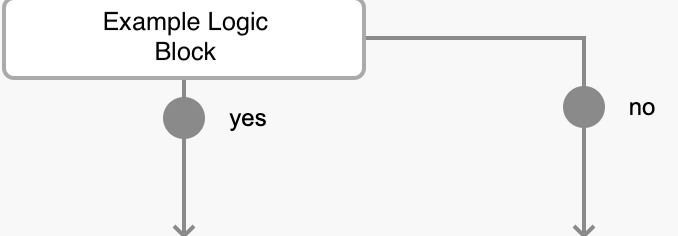
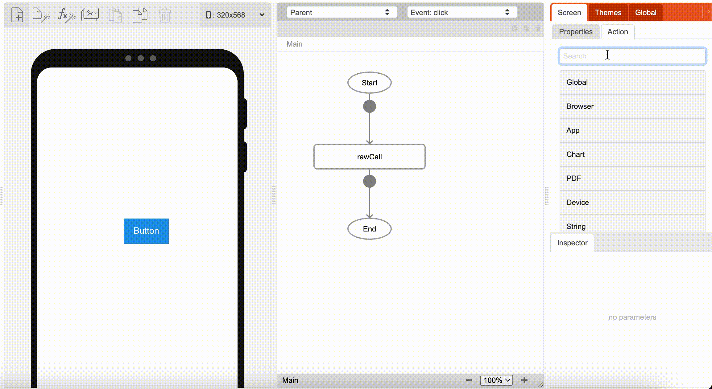

# Callbacks

## Introduction

Callbacks are a fundamental concept that enables the sequential execution of logic and the direct passing of data between logic blocks. They function conceptually similar to JavaScript callbacks and are represented visually as named arrows within our visual logic interface.

In eMOBIQ, a callback is initiated by a "source" logic block and received by a "callback" logic block. The source logic block is the one initiating the operation, whereas the callback logic block is the one executed after the source logic block completes its task.

## Purpose of Callbacks

Callbacks primarily serve two purposes:

1. **Sequential Logic Execution:** Callbacks ensure the sequential execution of logic, especially after the completion of asynchronous actions. This guarantees that a specific callback logic block will only execute after the associated asynchronous action has concluded.

2. **Data Relay:** Callbacks enable the direct passing of data from one logic block to another. This data transfer is particularly useful for relaying information between the source and callback logic blocks.

## Callback Representation

In the visual logic interface, callbacks are represented as named arrows, such as "yes" callback or "no" callback. These arrows visually connect the sourrce logic block with its corresponding callback logic.

## Adding Callback Logic

When working with a logic block that supports callbacks, users can add another logic block as the callback logic block. During this process, eMOBIQ prompts the user to specify whether the new logic block should be added as a callback or on the same level as the asynchronous logic block. The user can choose "same level" if they want the new logic block to execute concurrently with the asynchronous logic. In the example above, `rawCall` is the source function and `console` is the callback function. 

## Example Use Case

To illustrate the use of callbacks in eMOBIQ, consider the following scenario:

### Scenario

You are using the `rawCall` logic block to initiate a GET request from a web service. `rawCall` is an asynchronous non-blocking logic block, which means that logic blocks on the same level can execute concurrently.

### Implementation

1. **Sequential Execution Guarantee:** You want to ensure that a `setVar` logic block is executed only after `rawCall` has completed its asynchronous task. By connecting `setVar` as the 'yesCallback' of `rawCall`, you guarantee that `setVar` will not execute until `rawCall` is done.

2. **Data Relay:** Additionally, if you want `setVar` (callback logic block) to directly receive data from `rawCall` (source logic block) for further processing. This data transfer is achieved through 'input' and 'extra' parameter types, allowing `setVar` to access data passed by `rawCall`.

By leveraging callbacks in this way, you can maintain control over the sequence of logic execution and efficiently pass data between relevant logic blocks, enhancing the functionality and reliability of your workflow.
