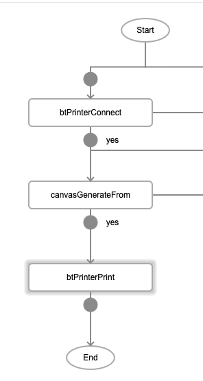
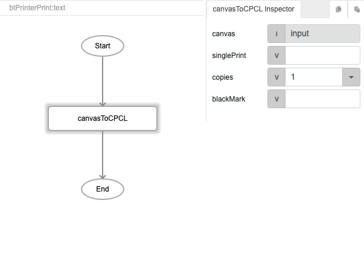
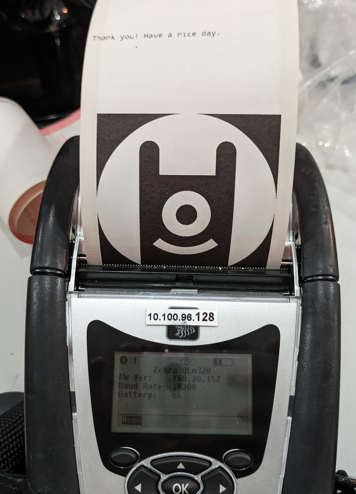

# canvasGenerateFrom

## Description

Converts a file data to a canvas, canvas are mainly used for printing.

## Input / Parameter

| Name | Description | Data Type | Default | Options | Required |
| ------ | ------ | ------ | ------ | ------ | ------ |
| type | The data type of the file to be converted. | String/Text | base64 | base64 | No |
| value | The data of the file to be converted. | Any | - | - | Yes | 
| fileType | The type of file to be converted. | String/Text | image | image, pdf | No | 
| documentSize | If the 'fileType' is 'pdf', this parameter is used to scale the size appropriately. | String/Text or Number | - | a4, {Any  Number} | No | 

<!-- | callback | When the function was triggered successfully. | Function List | No | -->
<!-- | errorCallback | When the function trigger failed successfully. | Function List | No | -->

## Output

N/A

## Callback?

### callback

The function to be executed when the canvas is generated successfully.

### errCallback

The function to be executed when the canvas is not generated.

## Video

Coming Soon.

<!-- Format:  -->

## Example

<!-- Share a scenario, like a user requirements. -->

### Steps

1. In this example, we will connect to a bluetooth printer, use `canvasGenerateFrom` to generate a canvas from an image, and then send that canvas to the printer for printing.

    

2. For `btPrinterConnect`, enter the `printerId` of the bluetooth printer.

3. For `canvasGenerateFrom`, enter the details of the image or PDF to be converted to canvas. In this example we are using a base64 string of an image. 

    | Field | Value | 
    | ---- | ---- | 
    | type | base64 |
    | value | *(base64-encoded string of your image)* |
    | fileType | image | 

    

4. For `btPrinterPrint`, under the "text" field, add a function `canvasToCPCL` to convert the canvas format into CPCL (a language used by thermal printers).

    

### Result

Image will be printed by the connected bluetooth printer. 

<!-- Explain the output.

Format:  -->

## Links
