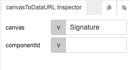

# canvasToDataURL

## Description

Converts the value in a signature component to dataURL.

## Input / Parameter

| Name | Description | Input Type | Default | Options | Required |
| ------ | ------ | ------ | ------ | ------ | ------ |
| canvas | The name of the component. | String/Text | - | - | Yes |
| componentId | The id of the component. | String/Text | - | - | No |

## Output

| Description | Output Type |
| ------ | ------ |
| Returns the dataURL of the signature. | String/Text |

## Callback

N/A

## Video

Coming Soon.

<!-- Format:  -->

## Example

The user want get the value of signature component and send to the server for processing.

### Step

1. Find the signature component. 

    
    

2. Draw a signature component "Signature",  a button "canvasToDatURL".

    
    

3. Call the function by adding a console -> canvasToDataURL in button event.

    

4. Use the name of the signature component inside the function parameters.

    
    
### Result

In the console of browser, user can see the dataURL of signature component.

## Links