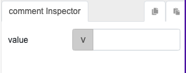

# comment

## Description

Provides a note for developers to refer to during development stage.

## Input / Parameter

| Name | Description | Input Type | Default | Options | Required |
| ------ | ------ | ------ | ------ | ------ | ------ |
| value | The comment or note to be made. | String/Text | - | - | Yes |

## Output

N/A

Note: The comment function node will be updated to show the value specified by the user.

## Callback

N/A

## Video

Coming Soon.

<!-- Format:  -->

## Example

The user wants to add a note while development 

### Step

1. Call Function "comment"

     

     

### Result

A guideline for developers to view a development note 

## Links