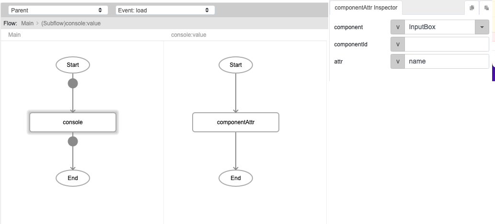

# componentAttr

## Description

Returns the attribute of a component, such as its name, dimensions etc.

## Input / Parameter

| Name | Description | Input Type | Default | Options | Required |
| ------ | ------ | ------ | ------ | ------ | ------ |
| component | The name of the component to get attribute from. | String/Text | - | - | Partial (Yes if no 'componentId'.) |
| componentId | The id of the component to get attribute from. | String/Text | - | - | Partial (Yes if no 'component'.) |
| attr | The attribute of the component. | String/Text | - | - | Yes |

__\* Note:__ Either component or componentId must have value in order for this function to work.

## Output

| Description | Output Type |
| ------ | ------ |
| Returns the attribute of the component. | String/Text |

## Callback

N/A

## Video

## Example

In this example we will get the name attribute of an input box component using `componentAttr` and print it to the console. 

### Steps

1. First we drag an input box onto the page. We will name it "InputBox" with the value "This is an input field"

2. We want to get the 'name' attribute of "InputBox" and display it in the browser console with the help of the `console` helper function. 
   
3. Drag `componentAttr` into the event flow, and specify the name of the component, which in this case is "InputBox".

### Result

- The `name` attribute of "InputBox" will be displayed in the browser console.

## Links
See also: 

* [`setComponentAttr`](./setcomponentattr)
* [`componentValue`](./componentvalue)