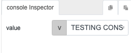

# console

## Description

Using this function will display the output/result in the browser console. 

## Input / Parameter

| Name | Description | Input Type | Default | Options | Required |
| ------ | ------ | ------ | ------ | ------ | ------ |
| value | The output to be shown in the browser console, such as characters, numbers or words. | String/Text | - | - | Yes |

## Output

| Description | Output Type |
| ------ | ------ |
| Returns the value specified in the parameter. | String/Text |

## Callback

N/A

## Video

Coming Soon.

<!-- Format:  -->

## Example

The user wants to view the result in console of broswer for debuging purpose.

### Step

1. Call the function.

    

    

### Result

## Links