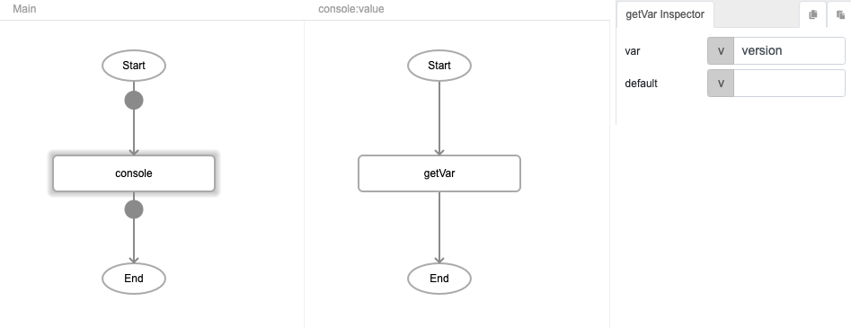
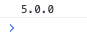

# getVar

## Description

Returns the value of a global variable.

## Input / Parameter

| Name | Description | Input Type | Default | Options | Required |
| ------ | ------ | ------ | ------ | ------ | ------ |
| var | The name of the variable. | String/Text | - | - | Yes |
| default | The default value of the variable. | String/Text | - | - | No |

## Output

| Description | Output Type |
| ------ | ------ |
| Returns the value of the global variable if there is a value, returns the `default` value otherwise. | String/Text |

## Callback

N/A

## Video

## Example

### Steps

1. Drag the `getVar` function into the event flow panel. (*Note: The `console` function is used here for ease of demostrating the output.)

2. Specify the variable name that you would like to access.

### Result

| Variable exists | Variable does not exist | 
| ---- | ---- | 
| If the specified global variable has previously been set (see `setVar`), the function will return the variable's value: ("1.0.0" in this example)    | If the specified global variable does not exist, the function will return the value in `default`:     |

## Links

* See also `setVar`