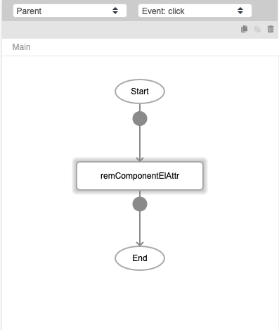
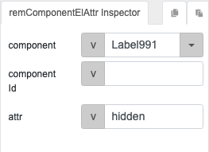

# remComponentElAttr

## Description

Removes a component element attribute.

## Input / Parameter

| Name | Description | Input Type | Default | Options | Required |
| ------ | ------ | ------ | ------ | ------ | ------ |
| component | The name of the component. | String/Text | - | - | Yes |
| componentId | The id of the component. | String/Text | - | - | Yes | 
| attr | The component element attribute to be removed. | String/Text | - | - | Yes | 

## Output

N/A

Note: The component will be updated to show the element attribute removed.

## Callback

N/A

## Video

Coming Soon.

<!-- Format:  -->

## Example

Coming Soon.

<!-- Share a scenario, like a user requirements. -->

### Steps

1. Add a button to the page, and add the `remComponentElAttr` to the event flow. 

    

2. Specify the component and element attribute to remove. 

    

<!-- Show the steps and share some screenshots.

1. .....

Format:  -->

### Result

Label991 will be shown, since the "hidden" attribute is removed. 

<!-- Explain the output.

Format:  -->

## Links