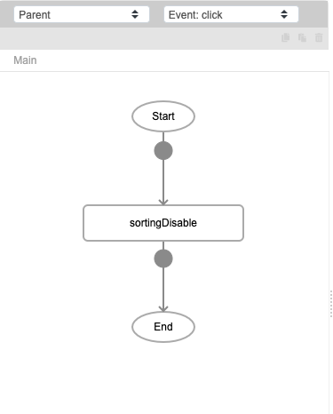
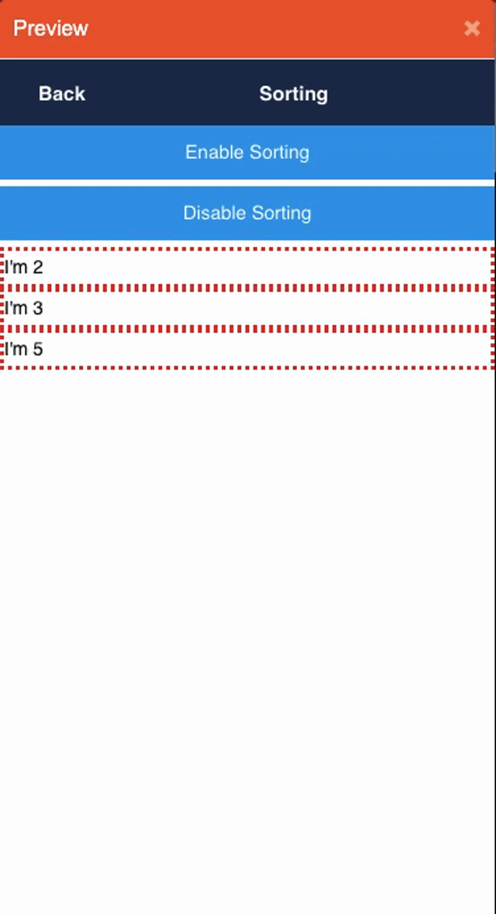

# sortingDisable

## Description

Disables the ability to sort a datalist component. 

## Input / Parameter

N/A

## Output

N/A

## Callback

N/A

## Video

Coming Soon.

<!-- Format:  -->

## Example

- In this example, we will disable the sorting functionality for a datalist. For steps on how to create the datalist used in this example, please check out the `sortingEnable` function.
<!-- Share a scenario, like a user requirements. -->

### Steps

1. First, we add a "Disable Sorting" button to the page. And add `sortingDisable` when the button is clicked. 
   
    
    

### Result

Any previously sortable components will not longer be sortable. 

<!-- Explain the output.

Format:  -->

## Links