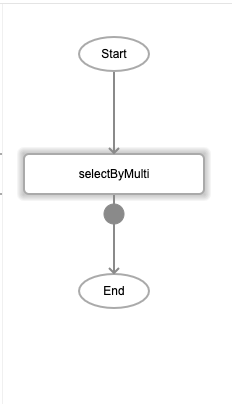
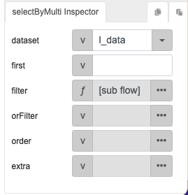
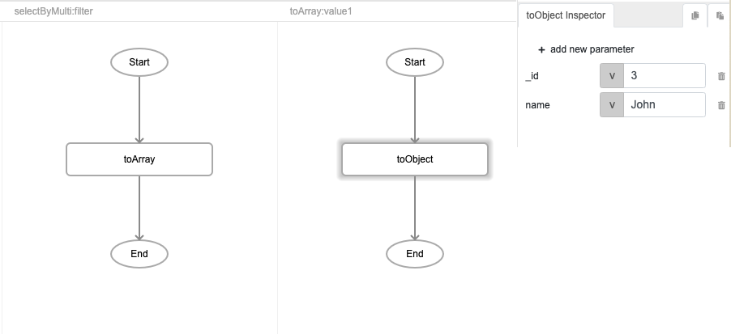
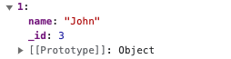

# selectByMulti

## Description

Retrieves the specified records from multiple fields in a dataset.

## Input / Parameter

| Name | Description | Input Type | Default | Options | Required |
| ------ | ------ | ------ | ------ | ------ | ------ |
| dataset | The name of the local table to select the records from. | String/Text | - | - | Yes |
| first |  | String/Text | - | - | No |
| filter | The filters for the field and value to select. | Array/List | - | - | Yes |
| orFilter | Additional filters for the field and value to select. | Array/List | - | - | No |
| extra | Extra parameters stored and passed to callback. | Any | - | - | No |

## Output

| Description | Output Type |
| ------ | ------ |
| Returns the list of records selected from the local table. | Array/List |

## Callback?

### callback

The function to be executed if the specified records are selected successfully.

### errorCallback

The function to be executed if the specified records are not selected successfully.

## Video

Coming Soon.

<!-- Format:  -->

## Example

<!-- Share a scenario, like a user requirements. -->

### Steps

1. Drag the `selectByMulti` function into the event flow.
    
    

2. Specify the "dataset" to select from, which in our example will be "l_data". 

    

3. Under the "filter" field, use `toArray` then  `toObject` to specify the fields to filter on. 

    

<!-- Show the steps and share some screenshots.

1. .....

Format:  -->

### Result

Returns the record where _id=3 and name=John

<!-- Explain the output.

Format:  -->

## Links