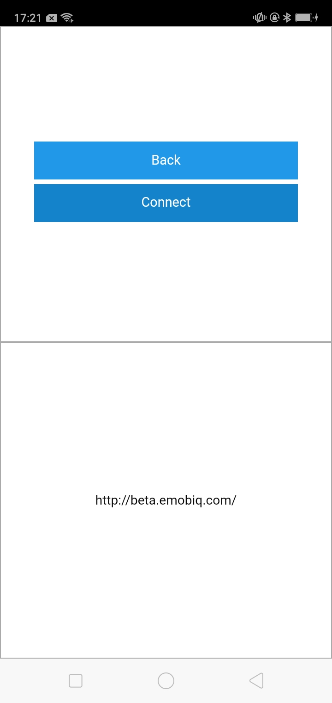

# socketDisconnect

## Description

Creates a TCP connection through a socket.

## Input / Parameter

| Name | Description | Input Type | Default | Options | Required |
| ------ | ------ | ------ | ------ | ------ | ------ |
| type | The type of connection. | String/Text | - | - | Yes |
| name | The name of the connection. | String/Text | default | - | No |
| host | The host for the connection. | String/Text | - | - | Yes |
| port | The port for the connection. | String/Text | - | - | Yes |
| authorization | The authorization for the connection. | String/Text | - | - | Yes |

## Output

N/A

## Callback

### callback

The function to be executed if the connection is created successfully.

### errorCallback

The function to be executed if the connection is not created successfully.

## Video

Coming Soon.

<!-- Format:  -->

## Example

The user wants to create a connection and view the socket input if it is successful.

<!-- Share a scenario, like a user requirements. -->

### Steps

1. Drag a button and label component to a page in the mobile designer. Call the function `socketConnect` in the button component. 

    

    

2. Call the function `console` in the callbacks of the `socketConnect` function. Select the parameter type `input` for the `value` parameter.

    

3. Call the function `setComponentValue` and select the label component in the `component` parameter. Set the `value` parameter type to `input`.

    

    

<!-- Show the steps and share some screenshots.

1. .....

Format:  -->

### Result

If the socket connection is successful, the host name will be shown in the label component.

<!-- Explain the output.

Format:  -->

## Links