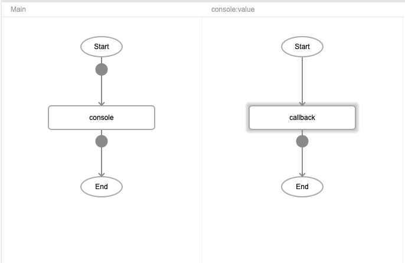
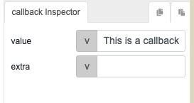
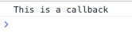

# callback

## Description

This function is used to trigger a flow of actions.

## Input / Parameter

| Name | Description | Input Type | Default | Options | Required |
| ------ | ------ | ------ | ------ | ------ | ------ |
| value | The value to be returned by the 'callback'. | Any | - | - | Yes |
| extra | The value to be included to the 'callback' as a system value under 'extra'. | Any | - | - | No |

## Output

N/A

## Callback

### yesCallback

The function to be executed immediately.

| Description | Output Type |
| ------ | ------ |
| Returns the 'value'. | Any |

## Video

Coming Soon.

<!-- Format:  -->

## Example

### Steps

1. First we add the `callback` function with "value" of the `console` function. Then we add the value we wish to pass to the console function, which in this case is the string "This is a callback".

    
    

### Result

## Links