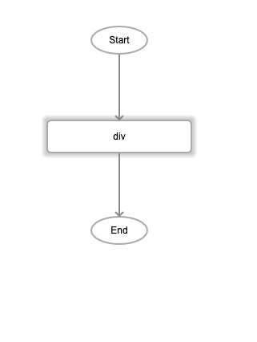
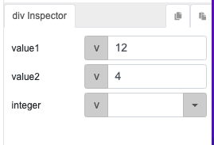
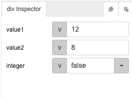
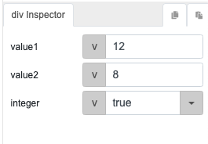

# div

## Description

Division of two numbers. The output will return the quotient of the two values.

## Input / Parameter

| Name | Description | Input Type | Default | Options | Required |
| ------ | ------ | ------ | ------ | ------ | ------ |
| value1 | The dividend, or the number to be divided. | Number | - | - | Yes |
| value2 | The divisor, or the number to divide the first value by. | Number | - | - | Yes |
| integer | Decide whether to return the output as an integer (quotient rounded off to the nearest whole number) or a decimal. | Boolean | false | true, false | No |

## Output

| Description | Output Type |
| ------ | ------ |
| Returns the quotient. | Number |

## Callback

N/A

## Video

Coming Soon.

<!-- Format:  -->

## Example

1. Drag the `div` function into the event flow.

    

| Values | Expected result | 
| ---- | ---- | 
|  | 3 |
|  | 1.5 |
|  | 1 |

## Links