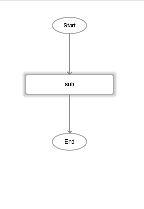
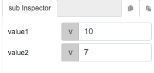

# sub

## Description

Substract two numbers. The output will return the difference between the two values.

## Input / Parameter

| Name | Description | Input Type | Default | Options | Required |
| ------ | ------ | ------ | ------ | ------ | ------ |
| value1 | The number to be subtracted from. | Number | - | - | Yes |
| value2 | The number to subtract from the first value. | Number | - | - | Yes |

## Output

| Description | Output Type |
| ------ | ------ |
| Returns the difference between the two values. | Number |

## Callback

N/A

## Video

Coming Soon.

<!-- Format: []({url-link}) -->

## Example

1. Drag the `sub` function into the event flow.

    

2. Enter the 2 values. For this example we are subtracting 7 from 10.

    

### Result

```3```

<!-- Explain the output.

Format:  -->

## Links