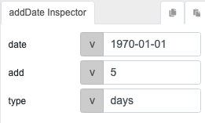

# addDate

## Description

Adds a specific duration or increment to a date, returns a string of the new date in the format YYYY-MM-DD.

## Input / Parameter

| Name | Description | Input Type | Default | Options | Required |
| ------ | ------ | ------ | ------ | ------ | ------ |
| date | The date to be modified. Supports most date formats, for example *1970-01-01* and *1 Jan 1970*  | Date Object | *The current day's date* | - | Yes |
| add | The duration to be added. | Number | 0 | - | Yes |
| type | The duration type of 'add'. | String/Text | days | days, hours, minutes, seconds | No |

## Output

| Description | Output Type |
| ------ | ------ |
| Returns the modified date in the format `YYYY-MM-DD` | String/Text |

## Callback

N/A

## Video

Coming soon.

## Example

## Steps

### Results
Using the `addDate` function with the above parameters will return a string with the value `1970-01-06` which is 5 days after `1970-01-01`.

## Links