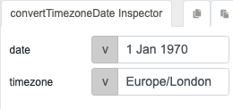

# convertTimezoneDate

## Description

Converts a date from one timezone to another, changing the date to match a different timezone's local time.

## Input / Parameter

| Name | Description | Input Type | Default | Options | Required |
| ------ | ------ | ------ | ------ | ------ | ------ |
| date | The datetime to be modified. | String/Text | Current date at 00:00:00 | - | Yes |
| timezone | The timezone to apply. | String/Text | - | UTC, [IANA Time Zone List] | Yes |

Note: For [IANA Time Zone List], please use the Zone ID.

## Output   

| Description | Output Type |
| ------ | ------ |
| Returns the modified datetime | String/Text |

## Callback

N/A

## Video

Coming soon.

## Example

## Steps

1. Assuming current timezone being Asia/Singapore.
   
2. Using the `convertTimezoneDate` function with the parameters 
   
   

### Results

Will return a string: 

```
12/31/1969, 05:30:00PM
```

## Links

[IANA Time Zone List]: <https://nodatime.org/TimeZones>