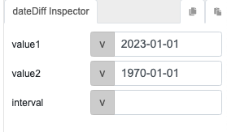

# dateDiff 

## Description

Calculates the difference between two dates, measuring the duration or interval between them in terms of days, weeks, months, etc.

## Input / Parameter

| Name | Description | Input Type | Default | Options | Required |
| ------ | ------ | ------ | ------ | ------ | ------ |
| value1 | The start date, this becomes the subtrahend. | String/Text | (Current-Date) | - | Yes |
| value2 | The end date, this becomes the minuend. | String/Text | (Current-Date) | - | Yes |
| interval | The value to be checked. | String/Text | days | years, months, weeks, days, hours, minutes, seconds | No |

## Output   

| Description | Output Type |
| ------ | ------ |
| Returns the difference between two dates in terms of days. Will be negative if `value2` is an early date than `value1` | Number/Integer |

## Callback

N/A

## Video

Coming soon.

## Example

### Steps

1. Using the dates `2023-01-01` and `1970-01-01`



### Result

Will return the value: 

```
-19358
```


## Links