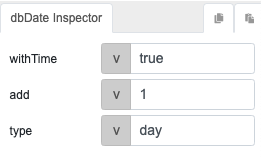
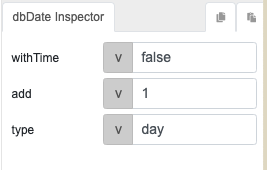
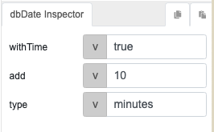
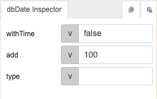

# dbDate

## Description

Retrieves the current date and enables adding a specific duration or increment to a date.

## Input / Parameter
    
| Name | Description | Input Type | Default | Options | Required |
| ------ | ------ | ------ | ------ | ------ | ------ |
| withTime | If time is included in the result | Boolean | false | - | Yes |
| add | The duration to be added in the current date. | Number | 0 | - | No |
| type | The duration type of 'add'. | String/Text | days | days, hours, minutes, seconds  | No |

## Output   

| Description | Output Type |
| ------ | ------ |
| Returns the calculated date or datetime. | String/Text |

## Callback

N/A

## Video

Coming soon.

## Example

Assuming current datetime is 01-Jan-2023 10:00AM. The table below lists some sample inputs and the expected output by the `dbDate` function.

| Function inputs | Expected result | Explanation | 
| ------ | ------ | ------ | 
|  | `2023-01-02 10:00:00` | 1 day after today, with timestamp |
|  | `2023-01-02` | 1 day after today, without timestamp | 
|  | `2023-01-01 10:10:00` | 10 minutes after current time (10AM) | 
|  | `2023-04-11` | 100 days after today, without timestamp

## Links