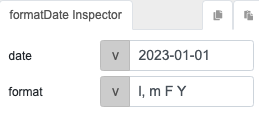
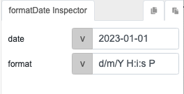
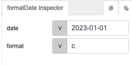

# formatDate

## Description

Converts a date into a specific desired format, such as changing the display of a date from one representation to another.

## Input / Parameter
    
| Name | Description | Input Type | Default | Options | Required |
| ------ | ------ | ------ | ------ | ------ | ------ |
| date | The date to be formatted. | String/Text | (Current-Date) | - | Yes |
| format | The format to apply to the date. See 'Date Format' after this table, take note that you can combine the available format. e.g. Y-m-d, m/d/Y. | String/Text | - | *see below* | Yes |

### Date formats

| Date formats | Description |
| ------ | ------ | 
| q | Total Days | 
| d | Day of month with leading 0. 01..31 | 
| j | Day of month. 1..31 | 
| l | Full day name. Monday..Sunday | 
| D | Shortened day name. Mon..Sun | 
| W | ISO-8601 week number. | 
| w | Day of week. 0..6 | 
| N | ISO-8601 day of week. 1..7 | 
| z | Day of year. 0..365 | 
| S | Ordinal suffix for day of month. st, nd, rd, th | 
| F | Full month name. January..December | 
| M | Shorthand month name. Jan..Dec | 
| m | Month with leading 0. 01..12 | 
| n | Month. 1..12 | 
| t | Days in month. 28..31 | 
| o | ISO-8601 year. | 
| Y | Full year. | 

### Time formats

| Time formats | Description |
| ------ | ------ | 
| y | Last two digits of the year. 00...99 | 
| L | Is leap year. 0, 1 | 
| a | Morning or afteroon lowercase. am, pm | 
| A | Morning or afteroon uppercase. AM, PM | 
| B | Swatch Internet time. 000..999 | 
| g | 12-Hours. 1..12 | 
| G | 24-Hours. 0..23 | 
| h | 12-Hours with leading 0. 01..12 | 
| H | 24-Hours with leading 0. 00..23 | 
| i | Minutes with leading 0. 00..59 |
| s | Seconds with leading 0. 00..59 |
| u | Microseconds. 000000..999000 |
| I | DST observed. 0, 1 |

### Timezone and others
| Format | Description | Example for Asia/Singapore | 
| ------ | ------ | -----: |  
| O | GMT timezone offset in hours. | +0800 | 
| P | GMT timezone offset in hours, including colon  | +08:00 | 
| Z | GMT timezone offset in seconds. | 28800 | 
| c | ISO-8601 datetime | 1970-01-01T00:00:00+08:00 | 
| r | RFC 2822 date. |
| U | Seconds since UNIX epoch. |

## Output   

| Description | Output Type |
| ------ | ------ |
| Returns the formatted date. | String/Text |

## Callback

N/A

## Video

Coming soon.

## Example

| Input | Expected result | Explanation | 
| ---- | ---- | ---- | 
|  | Sunday, 01 January 2023 |
|  | 01/01/2023 00:00:00 +08:00 |  |
|  | 2023-01-01T00:00:00+08:00 | ISO-8601 datetime |

## Links