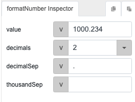
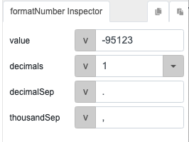

# formatNumber

## Description

Converts a number into a specific desired format, such as adding commas for thousands separators or specifying decimal places.

## Input / Parameter

| Name | Description | Input Type | Default | Options | Required |
| ------ | ------ | ------ | ------ | ------ | ------ |
| value | The number to be formatted. | Number | 0 | - | Yes |
| decimals | The number of decimal places. | Number | 0 | - | No |
| decimalSep | Decimals separator. | String/Text | , | - | No |
| thousandSep | Thousands separator. | String/Text | - | - | No |

## Output   

| Description | Output Type |
| ------ | ------ |
| Returns the formatted number. | Number |

## Callback

N/A

## Video

Coming soon.

## Example

| Function inputs | Expected result |
| ---- | ----: | 
|  | `1 000.23` | 
|  | `-95,123.0` | 

## Links