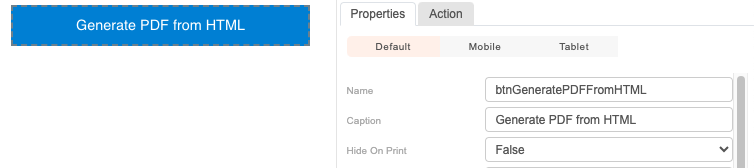
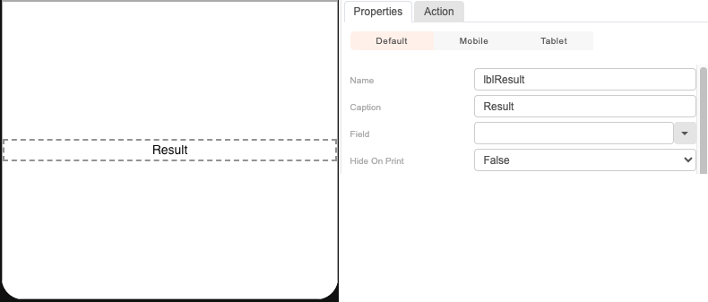
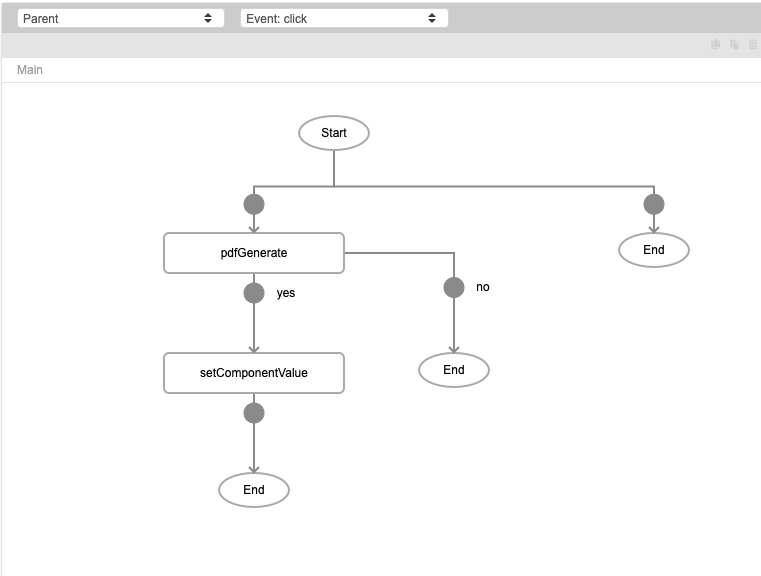
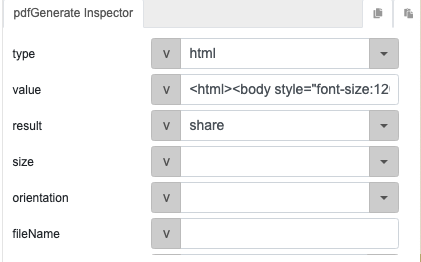
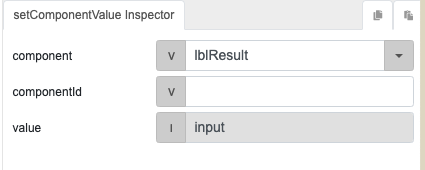
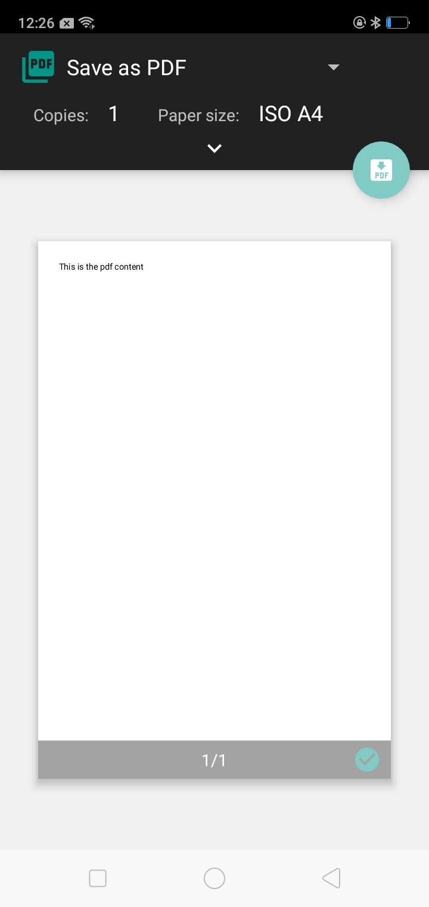

# pdfGenerate

## Description

Generates a PDF.

## Input / Parameter

| Name | Description | Input Type | Default | Options | Required |
| ------ | ------ | ------ | ------ | ------ | ------ |
| type | The type of data to use. | String/Text | url | url, html | No |
| value | The value of the PDF file. | String/Text | - | - | Yes |
| result | The result of the PDF file. | String/Text | base64 | base64, share | Yes |
| size | The size of the PDF file. | String/Text | A4 | A4, A3, A2 | Yes |
| orientation | The orientation of the PDF file. | String/Text | portrait | portrait, landscape | Yes |
| fileName | The name of the PDF file. | String/Text | - | - | Yes |
| extra | Extra parameters stored and passed to callback. | Any | - | - | No |

## Output

N/A

## Callback?

### callback

The function to be executed if the PDF is generated successfully.

### errorCallback

The function to be executed if the PDF is not generated successfully.

## Video

Coming Soon.

<!-- Format: []({url-link}) -->

## Example

In this example, we will generate a PDF from HTML and return the PDF file to the user. 

### Steps

1. First we add a button component onto the canvas, and name it `btnGeneratePDFFromHTML`.

    

2. Then we also add a label named `lblResult` which will display the PDF file once it is generated. 
3. 
    

4. We click on the `btnGeneratePDFFromHTML` button from step 1 and select "Actions". We add the `pdfGenerate` function first. We add a  `setComponentValue` to the flow, for when pdfGenerate returns `true`. 

    

5. For pdfGenerate function, open the inspector and add the following parameters: 

    

    | | |
    | ---- | ---- | 
    | type | html | 
    | value | ```<html><body style="font-size:120%">This is the pdf content</body></html> ```| 
    | result | share | 

6. For setComponentValue function, set the component to the label lblResult we created in step 2. 

    


### Result

When the user clicks on the button, it will generate a PDF with the text "This is the pdf content".




<!-- Explain the output.

Format:  -->

## Links