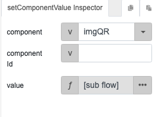

# generatePaynowQR

## Description

Generates a Paynow QR code.

## Input / Parameter

| Name | Description | Input Type | Default | Options | Required |
| ------ | ------ | ------ | ------ | ------ | ------ |
| formatIndicator | The format indicator for the QR code. | String/Text | - | - | Yes |
| initiationMethod | The initiation method. | Array/List | - | - | Yes |
| accountIdentifier | The account id. | String/Text | - | - | Yes |
| accountProxyType | The proxy type of the account. | String/Text | - | - | Yes |
| accountProxyValue | The proxy value of the account. | String/Text | - | - | Yes |
| editableAmountIndicator | The editable amount indicator. | String/Text | - | - | Yes |
| qrExpiryDate | The expiry date of the QR code. | String/Text | - | - | Yes |
| merchantCategoryCode | The category code of the merchant. | String/Text | - | - | Yes |
| transactionCurrency | The currency of the transaction. | String/Text | - | - | Yes |
| transactionAmount | The transaction amount. | String/Text | - | - | Yes |
| countryCode | The country code of the merchant. | String/Text | - | - | Yes |
| merchantName | The name of the merchant. | String/Text | - | - | Yes |
| merchantCity | The city of the merchant. | String/Text | - | - | Yes |
| billNumber | The bill number for the transaction. | String/Text | - | - | Yes |
| logo | The logo of the QR code. | String/Text | - | - | No |
| extra | Extra parameters stored and passed to callback. | Any | - | - | No |

## Output

N/A

## Callback?

### callback

The function to be executed if the Paynow QR code is generated successfully.

### errorCallback

The function to be executed if the Paynow QR code is not generated successfully.

## Video

Coming Soon.

<!-- Format:  -->

## Example

### Steps

1. First we add 2 components to the page: 
   1. A button to generate the QR code
   2. `imgQR`, an image placeholder for the QR code once generated.

    

2. Select the "Generate QR Local" button and add these 2 functions to the event flow:

    

3. Specify the parameters for the QR code. 

4. For the `setComponentFunction`, we set the "component" value to "imgQR", the image placeholder created in step 1. 

    

    For 'value', we add a subflow with the function "objectAttr" like so: 

    

### Result

## Links