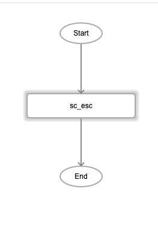

# sc_esc

## Description

Returns an ASCII escape character, which refers to the table below:

| Decimal | Hex | Oct | Char |
| ------ | ------ | ------ | ------ |
| 27 | 1B | 033 | ESC |

## Input / Parameter

N/A

## Output

| Description | Output Type |
| ------ | ------ |
| Returns the ASCII escape character. | String/Text |

## Callback

N/A

## Video

Coming Soon.

<!-- Format: []({url-link}) -->

## Example

### Steps

1. Draw the `sc_esc` function into the event flow.

    

### Result

```
␛
```

<!-- Explain the output.

Format:  -->

## Links