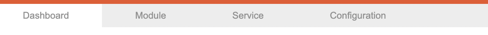
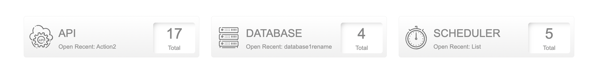
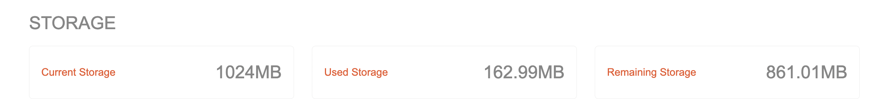
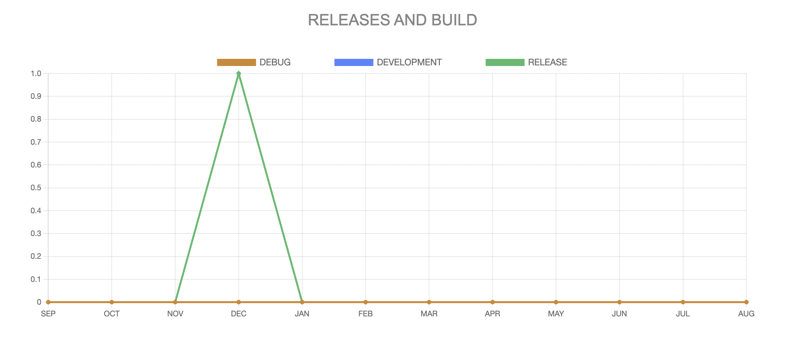

# Dashboard

## Description

A page that provides an overview of the application's total modules, storage usage, as well as the number of releases per month based on build type (Debug, Development, Release).

Access this page through the dashboard menu in the toolbar.

## Contents
### Total Counts

Shows the total number of created modules:

- **Total APIs**
- **Total Databases**
- **Total Schedulers**

### Open Recent

Shows the latest updated Api, Database, and Scheduler.

### Storage Usage

The application's storage information will display :

- **Current Storage**: maximum provided storage for the application
- **Used Storage**: total storage used by the application
- **Remaining Storage**: total storage left that can be used by the application

### Releases Overview

A graph depicting the number of build and releases per month as shown below:

Explore the different metrics and insights provided on this dashboard page to keep track of the application's performance and activities.