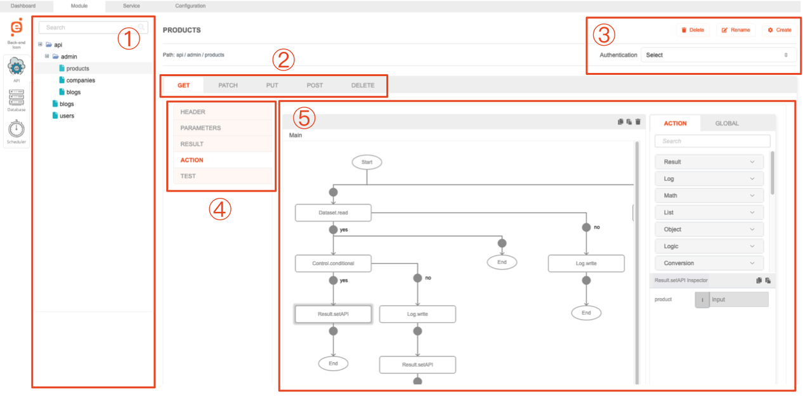

# API - General

## Description

This module allow to build a web service API endpoint.

## Features

- Create, modify, rename and delete existing API endpoint
- Group API endpoints into folders
- Configure behavior between different HTTP methods (GET, PATCH, PUT, POST, DELETE)
- Provide custom actions on each API endpoint via action flow
- Configure input for each endpoint based on supported channels (Header, Parameters) and types (Query, Body)
- Configure output for each endpoint with support of different data type (Text, JSON)
- Configure custom authentication layer for each of the API endpoint based on different methods (Basic Auth, OAuth2)
- Test and run the action flow itself

## Overview

1. **API list tree**: Shows the list of Action created under this project, Uses file-and-folder-based
   hierarchical system.
2. **Method tab**: Toggle between supported HTTP methods (GET, PATCH, PUT, POST, DELETE)
3. **Edit section**: Allow to rename or delete currently selected item, and also to create new one. In addition,
   contains Authentication dropdown to allow changing configuration on currently selected item.
4. **View tab**: Toggle between views on the API and customize behavior for each of the components listed.
5. **Action flow**: When **Action** tab is selected, allows to construct the functionality of the API itself.
