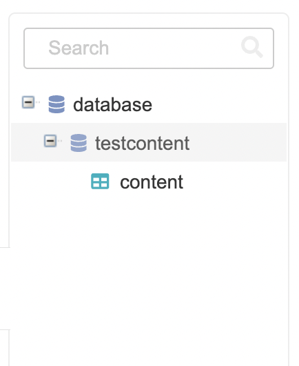
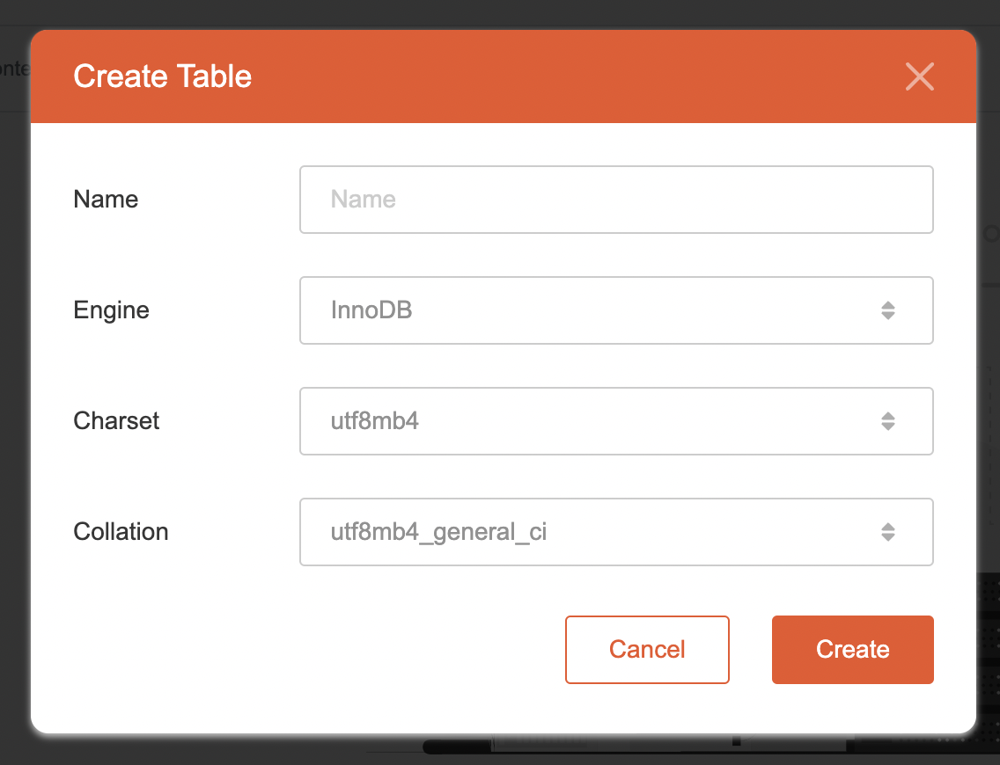
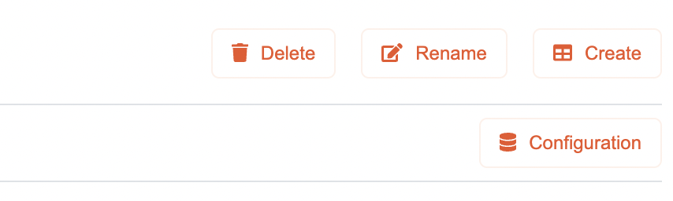

# Editing Database

## Create Database & Table

To create a new Database or Table,

1. Highlight the database / table where you want to create it, select on root database to create a new database or select on database / table to create new table.
   
2. Press the **Create** button at the middle of the main section.
   
3. Configure database creation.
   
   * Charset available:
      * **utf8mb4**
      * **latin1**
   * Collation available for **utf8mb4** Charset:
      * **utf8mb4_general_ci**
      * **utf8mb4_unicode_ci**
   * Collation available for **latin1** Charset:
      * **latin1_general_ci**
      * **latin1_swedish_ci**
4. The new database will be created inside the root database.
5. Alternatively, press the **Create** button on the top right section while highlighting the database root. The database will be created inside the root database.
   
6. To create a table, press the **Create** button at the middle of the main section while highlighting any database that user has created.
   
7. Configure table creation.
   
   * Engine available:
      * **InnoDB**
      * **MyISAM**
   * Charset available:
      * **utf8mb4**
      * **latin1**
   * Collation available for **utf8mb4** Charset:
      * **utf8mb4_general_ci**
      * **utf8mb4_unicode_ci**
   * Collation available for **latin1** Charset:
      * **latin1_general_ci**
      * **latin1_swedish_ci**
8. The new table will be created inside the highlighted database / on top of the highlighted table.
9. Alternatively, press the **Create** button on the top right section while highlighting a database or a table. The table will be created inside the highlighted database / on top of the highlighted table.
   

## Rename Database & Table

To rename a Database or Table,

1. Highlight the database / table which you want to rename
2. Press the **Rename** button on the top right section.
   
   and for table
   
3. Enter a new name for the database or table
   
   and for table
   
4. The new name will then be used.

## Modify Database & Table Configuration

To modify a Database or Table configuration,

1. Highlight the database or table which you want to modify.
2. Press the **Configuration** button on the top right section.
   
   Please notice that configuration button icon for configuring database and table is different:
   
   and for table
   
3. Change the database / table configuration
   
   For root database configuration these fields could be modified
      * **Host**
      * **Port**
      * **Username**
      * **Password**
   
   For database configuration these fields could be modified
      * Charset available:
         * **utf8mb4**
         * **latin1**
      * Collation available for **utf8mb4** Charset:
         * **utf8mb4_general_ci**
         * **utf8mb4_unicode_ci**
      * Collation available for **latin1** Charset:
         * **latin1_general_ci**
         * **latin1_swedish_ci**
   
   For table configuration these fields could be modified (Please take note that Engine cannot be changed from **InnoDB** to **MyISAM** after a table has been created and has foreign keys linked to it as **MyISAM** does not support foreign keys)
      * Engine available:
         * **InnoDB**
         * **MyISAM**
      * Charset available:
         * **utf8mb4**
         * **latin1**
      * Collation available for **utf8mb4** Charset:
         * **utf8mb4_general_ci**
         * **utf8mb4_unicode_ci**
      * Collation available for **latin1** Charset:
         * **latin1_general_ci**
         * **latin1_swedish_ci**
4. Confirm the configuration change. The item configuration will then be updated.

## Delete Database & Table

To delete a Database or a Table,

1. Highlight the database or table which you want to remove.
2. Press the **Delete** button on the top right section.
   
3. Confirm the deletion. The item will then be removed.